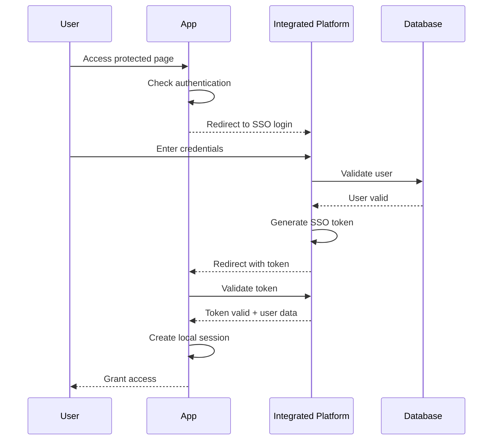

# 📚 KRYSTAL COMPANY INTEGRATED PLATFORM
## Complete System Documentation & Startup Guide

**Version**: 1.0.0
**Last Updated**: September 29, 2025
**Production Ready**: ✅ YES

---

## 🏗️ SYSTEM ARCHITECTURE OVERVIEW

```
┌─────────────────────────────────────────────────────────────┐
│          KRYSTAL COMPANY INTEGRATED PLATFORM               │
│                  (Master SSO Hub - Port 8080)              │
└──────────────────┬──────────────────────────────────────────┘
                   │
                   ├── SSO Authentication & Token Management
                   │
    ┌──────────────┼──────────────┬────────────────┬─────────────────┐
    │              │              │                │                 │
┌───▼────┐  ┌─────▼──────┐  ┌────▼────┐  ┌───────▼──────┐  ┌───────▼────────┐
│Expense │  │   Leave    │  │   CRM   │  │    Stripe    │  │ Cost Quotation │
│ System │  │   System   │  │ System  │  │  Dashboard   │  │     System     │
│ (8003) │  │   (8001)   │  │ (8004)  │  │    (8006)    │  │     (8005)     │
└────────┘  └────────────┘  └─────────┘  └──────────────┘  └────────────────┘
                   │
    ┌──────────────┼──────────────────────────────────────────┐
    │                                                         │
    │              PostgreSQL Database                        │
    │             (krystal_platform DB)                       │
    │                                                         │
    └─────────────────────────────────────────────────────────┘
```

---

## 🗂️ DIRECTORY STRUCTURE

```
/home/user/krystal-company-apps/
├── integrated_business_platform/    # Master SSO & Authentication Hub
│   ├── authentication/              # User authentication & SSO
│   ├── business_platform/           # Core settings & configuration
│   ├── dashboard/                   # Main dashboard views
│   ├── static/                      # Static files
│   ├── templates/                   # HTML templates
│   ├── venv/                        # Python virtual environment
│   └── manage.py                    # Django management script
│
├── company_expense_claim_system/    # Expense Management
│   ├── expense_system/              # Core expense app
│   ├── claims/                      # Claim management
│   ├── accounts/                    # User accounts
│   └── sso_integration.py          # SSO integration module
│
├── company-leave-system/            # Leave Management
│   ├── leave_management/            # Core leave app
│   ├── leave/                       # Leave application logic
│   └── sso_integration.py          # SSO integration module
│
├── company_crm_system/              # Customer Relationship Management
│   ├── crm_project/                 # CRM project settings
│   ├── crm/                         # CRM application
│   └── sso_integration.py          # SSO integration module
│
├── stripe-dashboard/                # Financial Dashboard
│   ├── app.py                       # Flask application
│   ├── templates/                   # Dashboard templates
│   └── csv_env/                     # Virtual environment
│
├── company-cost-quotation-system/  # Cost & Quotation Management
│   ├── quotation_system/            # Core quotation app
│   └── quotations/                  # Quotation logic
│
├── asset-movement-tracking-system/  # Asset Management
│   ├── asset_tracker/               # Asset tracking app
│   └── assets/                      # Asset management logic
│
└── krystal-brand.css               # Unified branding stylesheet
```

---

## 🚀 QUICK START GUIDE

### Prerequisites
- Python 3.12+
- PostgreSQL 14+
- Git
- Virtual Environment support

### 1️⃣ Database Setup

```bash
# Create PostgreSQL database
sudo -u postgres psql
CREATE DATABASE krystal_platform;
CREATE USER platformadmin WITH PASSWORD '5514';
GRANT ALL PRIVILEGES ON DATABASE krystal_platform TO platformadmin;
\q
```

### 2️⃣ Environment Configuration

Create `.env` file in each application directory:

```env
# Database Configuration
DB_ENGINE=django.db.backends.postgresql
DB_NAME=krystal_platform
DB_USER=platformadmin
DB_PASSWORD=5514
DB_HOST=localhost
DB_PORT=5432

# SSO Configuration
SSO_BASE_URL=http://localhost:8080
SSO_SECRET_KEY=your-secret-key-here

# Application Settings
DEBUG=True
SECRET_KEY=your-django-secret-key
```

### 3️⃣ Start All Applications

#### Option A: Sequential Startup Script

```bash
#!/bin/bash
# save as start_all_apps.sh

echo "Starting Krystal Company Applications..."

# 1. Start Integrated Platform (Master SSO)
cd /home/user/krystal-company-apps/integrated_business_platform
source venv/bin/activate
python manage.py migrate
python manage.py runserver 8080 &
echo "✅ Integrated Platform started on port 8080"

# 2. Start Expense System
cd /home/user/krystal-company-apps/company_expense_claim_system
source venv/bin/activate
python manage.py migrate
python manage.py runserver 8003 &
echo "✅ Expense System started on port 8003"

# 3. Start Leave System
cd /home/user/krystal-company-apps/company-leave-system
source venv/bin/activate
python manage.py migrate
python manage.py runserver 8001 &
echo "✅ Leave System started on port 8001"

# 4. Start CRM System
cd /home/user/krystal-company-apps/company_crm_system/crm_project
source ../.venv/bin/activate
python manage.py migrate
python manage.py runserver 8004 &
echo "✅ CRM System started on port 8004"

# 5. Start Stripe Dashboard
cd /home/user/krystal-company-apps/stripe-dashboard
source csv_env/bin/activate
python app.py &
echo "✅ Stripe Dashboard started on port 8006"

echo "🎉 All applications started successfully!"
```

#### Option B: Individual Application Startup

##### 🔐 Integrated Business Platform (Port 8080)
```bash
cd /home/user/krystal-company-apps/integrated_business_platform
source venv/bin/activate
python manage.py migrate
python manage.py runserver 8080
```

##### 💰 Expense Claim System (Port 8003)
```bash
cd /home/user/krystal-company-apps/company_expense_claim_system
source venv/bin/activate
python manage.py migrate
python manage.py runserver 8003
```

##### 🏖️ Leave Management System (Port 8001)
```bash
cd /home/user/krystal-company-apps/company-leave-system
source venv/bin/activate
python manage.py migrate
python manage.py runserver 8001
```

##### 👥 CRM System (Port 8004)
```bash
cd /home/user/krystal-company-apps/company_crm_system/crm_project
source ../.venv/bin/activate
python manage.py migrate
python manage.py runserver 8004
```

##### 💳 Stripe Dashboard (Port 8006)
```bash
cd /home/user/krystal-company-apps/stripe-dashboard
source csv_env/bin/activate
python app.py
```

##### 📊 Cost Quotation System (Port 8005)
```bash
cd /home/user/krystal-company-apps/company-cost-quotation-system
source venv/bin/activate
python manage.py migrate
python manage.py runserver 8005
```

##### 📦 Asset Tracking System (Port 8007)
```bash
cd /home/user/krystal-company-apps/asset-movement-tracking-system
source venv/bin/activate
python manage.py migrate
python manage.py runserver 8007
```

---

## 🔑 APPLICATION DETAILS

### 1. Integrated Business Platform (Master Hub)

| Component | Details |
|-----------|---------|
| **Purpose** | Central authentication hub, SSO provider |
| **Framework** | Django 4.2 |
| **Port** | 8080 |
| **Database** | PostgreSQL (krystal_platform) |
| **Key Features** | - User authentication<br>- SSO token generation<br>- Session management<br>- User profile management |
| **Admin Access** | http://localhost:8080/admin<br>Username: admin@krystal-platform.com |

### 2. Expense Claim System

| Component | Details |
|-----------|---------|
| **Purpose** | Employee expense claim management |
| **Framework** | Django 4.2 |
| **Port** | 8003 |
| **Database** | PostgreSQL (krystal_platform) |
| **Key Features** | - Expense claim submission<br>- Approval workflow<br>- Receipt management<br>- Reporting |
| **Access URL** | http://localhost:8003 |

### 3. Leave Management System

| Component | Details |
|-----------|---------|
| **Purpose** | Employee leave application and tracking |
| **Framework** | Django 4.2 |
| **Port** | 8001 |
| **Database** | PostgreSQL (krystal_platform) |
| **Key Features** | - Leave application<br>- Approval workflow<br>- Leave balance tracking<br>- Calendar view |
| **Access URL** | http://localhost:8001 |

### 4. CRM System

| Component | Details |
|-----------|---------|
| **Purpose** | Customer relationship management |
| **Framework** | Django 4.2 |
| **Port** | 8004 |
| **Database** | PostgreSQL (krystal_platform) |
| **Key Features** | - Customer management<br>- Contact tracking<br>- Sales pipeline<br>- Activity logging |
| **Records** | 1,010+ customers |
| **Access URL** | http://localhost:8004 |

### 5. Stripe Dashboard

| Component | Details |
|-----------|---------|
| **Purpose** | Financial transaction monitoring |
| **Framework** | Flask 3.0 |
| **Port** | 8006 |
| **Database** | PostgreSQL (krystal_platform) |
| **Key Features** | - Transaction history<br>- Payment analytics<br>- Revenue tracking<br>- Export capabilities |
| **Access URL** | http://localhost:8006 |

### 6. Cost Quotation System

| Component | Details |
|-----------|---------|
| **Purpose** | Cost estimation and quotation generation |
| **Framework** | Django 4.2 |
| **Port** | 8005 |
| **Database** | PostgreSQL (krystal_platform) |
| **Key Features** | - Quotation creation<br>- Cost calculation<br>- Client management<br>- PDF generation |
| **Access URL** | http://localhost:8005 |

### 7. Asset Movement Tracking System

| Component | Details |
|-----------|---------|
| **Purpose** | Company asset tracking and management |
| **Framework** | Django 4.2 |
| **Port** | 8007 |
| **Database** | PostgreSQL (krystal_platform) |
| **Key Features** | - Asset registration<br>- Movement tracking<br>- Assignment management<br>- Maintenance logs |
| **Access URL** | http://localhost:8007 |

---

## 🔐 SSO AUTHENTICATION FLOW



### SSO Integration Points

Each application includes `sso_integration.py` with:
- `SSOAuthenticationBackend`: Token validation
- `SSOMiddleware`: Request interceptor
- `map_sso_user_data()`: User data mapping
- `get_sso_login_url()`: Login URL generator

---

## 🎨 UNIFIED BRANDING

### Color Scheme
- **Primary**: Krystal Navy Blue (`#1e3d59`)
- **Secondary**: Krystal Gold (`#d4af37`)
- **Background**: Light Gray (`#f8f9fa`)
- **Text**: Dark Gray (`#333333`)

### Typography
- **Font Family**: Inter, system-ui, sans-serif
- **Headings**: Bold, navy blue
- **Body**: Regular, dark gray

### CSS Implementation
All applications use `/krystal-brand.css` for consistent styling:
```css
:root {
    --krystal-navy: #1e3d59;
    --krystal-gold: #d4af37;
    --krystal-light: #f8f9fa;
}
```

---

## 🗄️ DATABASE SCHEMA

### Unified PostgreSQL Database: `krystal_platform`

#### Key Tables
```sql
-- User Management
krystal_users               # Unified user model
authentication_companyuser  # Legacy user table
django_session             # Session management

-- Expense System
claims_expenseclaim        # Expense claims
claims_expenseitem         # Individual expense items
claims_expensecategory     # Expense categories

-- Leave System
leave_leaveapplication     # Leave applications
leave_leavetype           # Leave types
leave_leavebalance        # Employee leave balances

-- CRM System
crm_customer              # Customer records
crm_contact               # Contact information
crm_activity              # Customer interactions

-- Asset System
assets_asset              # Asset registry
assets_movement           # Asset movements
assets_maintenance        # Maintenance records
```

---

## 🛠️ MAINTENANCE & OPERATIONS

### Daily Operations

#### Check Application Status
```bash
# Check all running ports
netstat -tlnp | grep -E ":(8080|8001|8003|8004|8005|8006|8007)"

# Check PostgreSQL status
sudo systemctl status postgresql

# Check database connections
psql -U platformadmin -d krystal_platform -c "SELECT count(*) FROM pg_stat_activity;"
```

#### Backup Database
```bash
# Full database backup
pg_dump -U platformadmin -h localhost krystal_platform > backup_$(date +%Y%m%d).sql

# Application-specific backup
python manage.py dumpdata > backup_$(date +%Y%m%d).json
```

#### Update Applications
```bash
# Pull latest from GitLab
git pull origin main

# Update dependencies
pip install -r requirements.txt

# Run migrations
python manage.py migrate

# Collect static files
python manage.py collectstatic --noinput
```

### Troubleshooting

#### Common Issues & Solutions

| Issue | Solution |
|-------|----------|
| Port already in use | `lsof -i :PORT` then `kill -9 PID` |
| Database connection error | Check PostgreSQL service and credentials in .env |
| SSO authentication fails | Verify SSO_BASE_URL points to port 8080 |
| Migration conflicts | Run `python manage.py migrate --fake-initial` |
| Static files not loading | Run `python manage.py collectstatic` |

#### Log Locations
- Django apps: `logs/` directory in each app
- PostgreSQL: `/var/log/postgresql/`
- System: `journalctl -u SERVICE_NAME`

---

## 📊 MONITORING

### Health Check Endpoints

```bash
# Create health_check.sh
#!/bin/bash

echo "Checking Krystal Platform Health..."

# Check each application
curl -s http://localhost:8080/health/ && echo "✅ Integrated Platform: OK" || echo "❌ Integrated Platform: DOWN"
curl -s http://localhost:8003/ && echo "✅ Expense System: OK" || echo "❌ Expense System: DOWN"
curl -s http://localhost:8001/ && echo "✅ Leave System: OK" || echo "❌ Leave System: DOWN"
curl -s http://localhost:8004/ && echo "✅ CRM System: OK" || echo "❌ CRM System: DOWN"
curl -s http://localhost:8006/ && echo "✅ Stripe Dashboard: OK" || echo "❌ Stripe Dashboard: DOWN"
```

### Performance Metrics

```python
# Django performance monitoring
LOGGING = {
    'version': 1,
    'handlers': {
        'file': {
            'class': 'logging.FileHandler',
            'filename': 'logs/performance.log',
        },
    },
    'loggers': {
        'django.db.backends': {
            'handlers': ['file'],
            'level': 'DEBUG',
        },
    },
}
```

---

## 🚢 DEPLOYMENT

### Production Checklist

- [ ] Set `DEBUG = False` in all settings.py
- [ ] Configure production database credentials
- [ ] Set up HTTPS/SSL certificates
- [ ] Configure production SSO_SECRET_KEY
- [ ] Set up reverse proxy (nginx/Apache)
- [ ] Configure firewall rules
- [ ] Set up monitoring (Prometheus/Grafana)
- [ ] Configure backup automation
- [ ] Set up log rotation
- [ ] Document production URLs

### Docker Deployment (Optional)

```dockerfile
# Dockerfile for each Django app
FROM python:3.12-slim

WORKDIR /app

COPY requirements.txt .
RUN pip install -r requirements.txt

COPY . .

EXPOSE 8080

CMD ["python", "manage.py", "runserver", "0.0.0.0:8080"]
```

```yaml
# docker-compose.yml
version: '3.8'

services:
  postgres:
    image: postgres:14
    environment:
      POSTGRES_DB: krystal_platform
      POSTGRES_USER: platformadmin
      POSTGRES_PASSWORD: 5514
    volumes:
      - postgres_data:/var/lib/postgresql/data

  integrated_platform:
    build: ./integrated_business_platform
    ports:
      - "8080:8080"
    depends_on:
      - postgres
    environment:
      DB_HOST: postgres

  expense_system:
    build: ./company_expense_claim_system
    ports:
      - "8003:8003"
    depends_on:
      - postgres
      - integrated_platform

  # Add other services...

volumes:
  postgres_data:
```

---

## 📞 SUPPORT & RESOURCES

### GitLab Repositories
- Base URL: `https://gitlab.kryedu.org/company_apps/`
- Integrated Platform: `integrated_business_platform`
- Expense System: `company_expense_claim_system`
- Leave System: `company-leave-system`
- CRM System: `company_crm_system`
- Stripe Dashboard: `stripe-dashboard`

### Documentation
- Django: https://docs.djangoproject.com/
- Flask: https://flask.palletsprojects.com/
- PostgreSQL: https://www.postgresql.org/docs/

### Contact
- Technical Issues: Create issue on GitLab
- Database Admin: platformadmin@krystal-platform.com
- System Admin: admin@krystal-platform.com

---

## 📝 VERSION HISTORY

| Version | Date | Changes |
|---------|------|---------|
| 1.0.0 | 2025-09-29 | Initial production release with PostgreSQL migration |
| 0.9.0 | 2025-09-28 | SSO integration completed |
| 0.8.0 | 2025-09-27 | Unified branding applied |
| 0.7.0 | 2025-09-26 | Database consolidation |

---

## 📜 LICENSE

© 2025 Krystal Company. All rights reserved.

---

*This documentation is maintained as part of the Krystal Company Integrated Platform project.*
*Last generated: September 29, 2025*